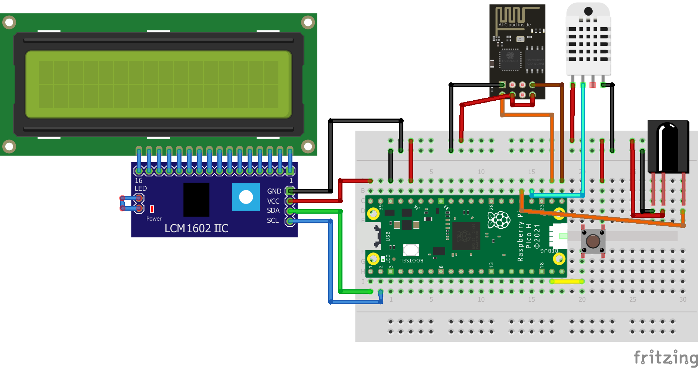

---

# ***Uwaga!***
Ta gałąź nie jest już rozwijana i nie zawiera dużej ilości funkcji względem *[głównej gałęzi](https://github.com/Io-Maciek/StacjaPogodowa/tree/pico_with_esp)*.

---

# Stacja pogodowa
Projekt wykorzystuje:
- [Raspberry Pi Pico W](https://botland.com.pl/moduly-i-zestawy-do-raspberry-pi-pico/21574-raspberry-pi-pico-w-rp2040-arm-cortex-m0-cyw43439-wifi-5056561803173.html) ***(model z internetem)***
- [Wyświetlacz LCD 4x20](https://botland.com.pl/wyswietlacze-alfanumeryczne-i-graficzne/19735-wyswietlacz-lcd-4x20-znakow-zielony-justpi-5903351243094.html)
- [Konwerter I2C](https://botland.com.pl/konwertery-pozostale/2352-konwerter-i2c-dla-wyswietlacza-lcd-hd44780-5903351248693.html)
- [Czujnik temperatury i wilgotności DHT22](https://botland.com.pl/czujniki-multifunkcyjne/2637-czujnik-temperatury-i-wilgotnosci-dht22-am2302-modul-przewody-5904422372712.html)
- Dowolny [odbiornik podczerwieni](https://botland.com.pl/odbiorniki-podczerwieni/4931-odbiornik-podczerwieni-tsop31236-36-khz-5904422302757.html)


# Funkcjonalności i plany
- [X] Podpięcie [wyświetlacza](https://botland.com.pl/wyswietlacze-alfanumeryczne-i-graficzne/19735-wyswietlacz-lcd-4x20-znakow-zielony-justpi-5903351243094.html) z [konwerterem I2C](https://botland.com.pl/konwertery-pozostale/2352-konwerter-i2c-dla-wyswietlacza-lcd-hd44780-5903351248693.html) i pokazywanie na nim informacji dla użytkownika
- [X] Łączenie się z WiFi
- [X] Czytanie informacji o temperaturze i wilgotności przez czujnik [DHT22](https://botland.com.pl/czujniki-multifunkcyjne/2637-czujnik-temperatury-i-wilgotnosci-dht22-am2302-modul-przewody-5904422372712.html)
- [X] Obsługa odbiornika podczerwieni dla komunikacji użytkownika z programem z pomocą [repozytorium micropython_ir](https://github.com/peterhinch/micropython_ir)
  - [X] zmiana godziny
  - [X] zciemnianie wyświetlacza
- [X] Pobieranie aktualnej godziny
- [X] Wyświetlanie polskich znaków
- [ ] Łączenie się z lokalnym serwerem
- [ ] Wysyłanie informacji z czujników na serwer
- [ ] Zapis informacji do bazy danych
- [ ] Dodanie czujników i sensorów
  - [ ] Czujnik pyłów


# Diagram połączenia



# Inicjacja
W głównym folderze Pico powinien znajdować się folder ```netinfo.txt```, który zawiera SSID i hasło do naszego WiFi w następującym formacie:
>SSID:::HASŁO   

(trzy dwukropki wymagane, ponieważ mogą występować w haśle)
